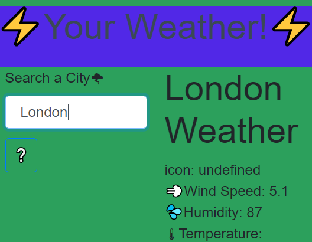

# Your-Weather-Site




## Description
```
As a traveler,I want to see the weather outlook with form inputs for multiple cities.
 
So that when I search for a city I am presented with current and future conditions for that city. 

So now I can plan a trip accordingly.
```

## Table of Contents 

* [Usage](#usage)

* [License](#license)

* [Contributing](#contributing)

* [Questions](#questions)


## Usage

Go to [Your-Weather-Site](https://travislovingood.github.io/Your-Weather-Site/) and enjoy.


## License

This project is licensed under the Oh Yeah License.
  
## Contributing

Travis Lovingood

## Questions

If you have any questions about the repo, open an issue or contact [Your-Weather-Site](https://github.com/TravisLovingood/Your-Weather-Site) directly at undefined.

