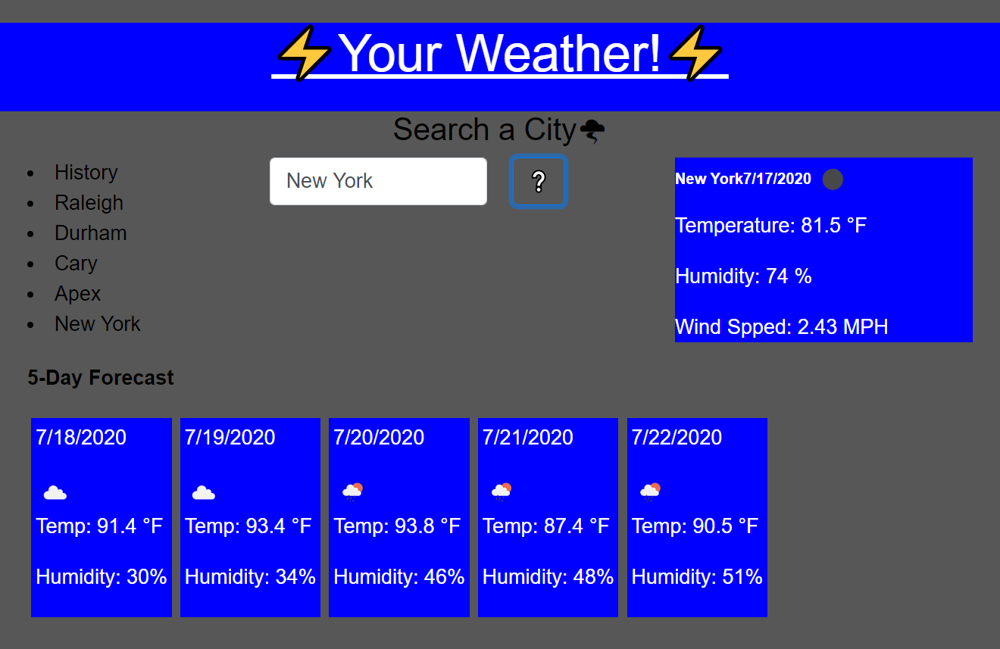

# Your-Weather-Site

## Description

This is a user friendly dashboard that runs using a third-party API ([Openweathermap.org](https://openweathermap.org/)) to retrieve weather forecast data. Users simply enter the name of the city to searches for the current and 5 day forecast. Your Weather runs featuring dynamically updated HTML, CSS, and localStorage. 

## Table of Contents 

* [Usage](#usage)

* [Installation](#installation)

* [License](#license)

* [Questions](#questions)

## Usage

Go to my [Your-Weather-Site](https://travislovingood.github.io/Password-Generator/) and enjoy.

## Installation

Open a new terminal and run 'npm install'.

## License

This project has no License.
  
## Questions

If you have any questions about the repo, open an issue or contact directly at [Your-Weather-Site](https://github.com/TravisLovingood/Your-Weather-Site/).

Also please take a look at [My Portfolio](https://travislovingood.github.io/Portfolio/).
